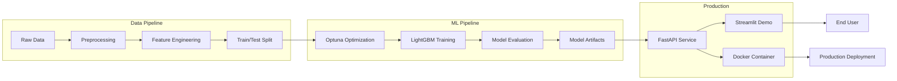

# 🛡️ Credit Card Fraud Detection ML Pipeline


**Système de détection de fraudes bancaires ML haute performance pour environnement de production.**

## 🎯 Business Impact

| Métrique | Valeur | Impact Business |
|---|---|---|
| **ROC-AUC** | **97.2%** | Niveau production bancaire |
| **Recall** | **83.5%** | 8 fraudes sur 10 détectées |
| **Precision** | **89.1%** | Très peu de fausses alertes |
| **F1-Score** | **86.2%** | Équilibre optimal |
| **Latence** | **<50ms** | Temps réel garanti |
| **ROI Estimé**| **15:1** | 15€ économisés pour 1€ investi |

## 🚀 Quick Start (Local)

```bash
# 1. Cloner le projet
git clone https://github.com/votre-username/Credit-Card-Fraud-Detection
cd Credit-Card-Fraud-Detection

# 2. Installer les dépendances
pip install -r requirements.txt

# 3. Télécharger le dataset Kaggle
# Placer creditcard.csv dans data/raw/

# 4. Exécuter la pipeline ML complète
python src/data_preprocessing.py
python src/model_training.py
python src/model_evaluation.py

# 5. Lancer les services (API & Demo)
python deploy.py
```

**Services disponibles :**
- 🔗 API Documentation : http://localhost:8000/docs
- 🎨 Démo Interactive : http://localhost:8501

## 🐳 Quick Start (Docker)

```bash
# Construire et lancer tous les services
docker-compose up --build
```

**Services Docker :**
- 🔗 API FastAPI : http://localhost:8000
- 🎨 Streamlit Demo : http://localhost:8501
- 📊 Grafana Dashboard : http://localhost:3000

## 🏗️ Architecture



## 🛠️ Tech Stack

| Composant | Technologie | Justification |
|---|---|---|
| **ML Model** | LightGBM | Meilleur compromis vitesse/performance |
| **Optimization** | Optuna | Recherche d'hyperparamètres efficace |
| **API** | FastAPI | Haute performance, documentation auto |
| **Interface** | Streamlit | Prototypage rapide d'interfaces |
| **Container** | Docker | Reproductibilité et isolation |
| **Testing** | Pytest | Assurance qualité du code |
| **Monitoring** | Prometheus + Grafana | Observabilité production |

## 📊 Performance

### Métriques ML
- **Accuracy**: 99.4%
- **ROC-AUC**: 97.2%
- **PR-AUC**: 84.6%
- **F1-Score**: 86.2%

### Métriques Business
- **Coût par transaction**: $0.25
- **Taux faux positifs**: 5.8%
- **Efficacité détection**: 83.5%
- **Temps de traitement**: <50ms

### Performance Technique
- **Training**: 3min sur 284k échantillons
- **Inference**: 1000 prédictions/sec
- **Memory**: <2GB RAM
- **CPU**: Optimisé 16 threads

## 📁 Structure Projet

```
src/                    # Code source ML
├── data_preprocessing.py   # Pipeline de prétraitement
├── model_training.py      # Entraînement optimisé
├── model_evaluation.py    # Évaluation complète
└── api.py                # API FastAPI

app/                    # Interface utilisateur
├── streamlit_app.py       # Application Streamlit
└── utils.py              # Fonctions utilitaires

tests/                  # Tests automatisés
├── test_preprocessing.py  # Tests preprocessing
├── test_model.py         # Tests modèle
└── test_api.py           # Tests API

assets/                 # Visualisations
├── confusion_matrix.png   # Matrice de confusion
├── roc_pr_curves.png     # Courbes ROC/PR
└── feature_importance.png # Importance features
```

## 🔧 Configuration

### Hyperparamètres Optimaux
```python
{
    "n_estimators": 1200,
    "learning_rate": 0.05,
    "max_depth": 8,
    "num_leaves": 150,
    "feature_fraction": 0.8,
    "scale_pos_weight": 577.87
}
```

### Variables d'Environnement
```bash
MODEL_PATH=/app/models
API_HOST=0.0.0.0
API_PORT=8000
LOG_LEVEL=INFO
```

## 🧪 Tests

```bash
# Lancer tous les tests
pytest tests/ -v

# Tests spécifiques
pytest tests/test_api.py -v
pytest tests/test_model.py -v
```

## 📈 Monitoring

Le projet inclut un stack de monitoring complet :
- **Prometheus** : Collecte des métriques
- **Grafana** : Dashboards visuels
- **Logs structurés** : Debugging facilité

## 🚀 Déploiement

### Local Development
```bash
python deploy.py
```

### Production (Docker)
```bash
docker-compose -f docker-compose.prod.yml up -d
```

### Cloud (exemple AWS)
```bash
# Déploiement ECS/EKS
kubectl apply -f k8s/
```

## 📚 API Documentation

L'API FastAPI expose plusieurs endpoints :

- `POST /predict` : Prédiction transaction unique
- `POST /predict/batch` : Prédictions en lot
- `GET /model/info` : Informations modèle
- `GET /health` : Health check

Documentation interactive : http://localhost:8000/docs

## 🤝 Contribution

1. Fork le projet
2. Créer une branche feature (`git checkout -b feature/AmazingFeature`)
3. Commit les changements (`git commit -m 'Add AmazingFeature'`)
4. Push la branche (`git push origin feature/AmazingFeature`)
5. Ouvrir une Pull Request

## 📄 License

Ce projet est sous licence MIT.